# Trigonometry on Cortex ARM

Benchmarking four methods of computing cos(x) on STM32H573:

- `cos(x)` math.h function for double input.
- `cosf(x)` math.h function for float input.
- `arm_cos_f32(x)` CMSIS DSP arm fast math function, for float input.
- STM32 CORDIC engine with extra operations needed for float input.

## A Note on the CORDIC Configuration

As with any hardware accelerator, the CORDIC engine can be configured once and used to perform a single type of operation, or if various types of operations are required, it can be configured each time it's needed, just before computation. Both cases will be compared: first, the worst case for CORDIC performance (dynamic config), when the engine is re-configured each time a ``cos(x) is required, and then the best performance case (static config), where CORDIC is configured once for the COSINE operation.

## Results

The table below shows the average ticks needed by each function depending on whether the FPU is enabled.

| Function                  | No FPU | FPU enabled |
|---------------------------|--------|-------------|
| cos(x)                    |    2260|         2323|
| cosf(x)                   |    1575|          314|
| arm_cos_f32(x)            |     960|          139|
| CORDIC (dynamic config)   |     566|          155|

```mermaid
xychart-beta
    title "Cosine time cost"
    x-axis [cos, cosf, arm_dsp, CORDIC]
    y-axis "CPU ticks" 50 --> 2500
    bar [2260, 1575, 960, 566]
    bar [2323, 314, 139, 155]
```



## Conclusion

- The base standard `cos(x)` function does not improve with FPU, likely due to the ARMv8-M FPU's limited operations with double precision inputs.
- The other three functions show significant improvement when the FPU is present.
- In its worst-case scenario, the CORDIC engine does not outperform the CMSIS DSP library.
- When configured once, the CORDIC engine is only slightly better than the CMSIS DSP (113 ticks compared to ~139).

## Raw data

### Code

```c
/*
 * Copyright (c) 2025 Alex Fabre alex.fabre@rtone.fr
 *
 * SPDX-License-Identifier: Apache-2.0
 */

#include <stdio.h>
#include <zephyr/kernel.h>
#include <soc.h>
#include <math.h>
#include <zephyr/dsp/types.h>
#include <stm32h5xx_ll_cordic.h>
#include <stm32h5xx_ll_bus.h>
#include "arm_math.h"

/* Use can select/deselect to compute only one of sin or cos, or both */
#define COMPUTE_COSINUS 1
#define COMPUTE_SINUS 0

#define USE_STD_DOUBLE 1
#define USE_STD_FLOAT 1
#define USE_CMSIS_FAST_MATH 1
#define USE_CORDIC 1

/* Constants and macros */
#if USE_CORDIC
#ifndef PI
#define PI 3.14159265358979323846f
#endif
#define Q31_FACTOR (0x80000000)

#define FLOAT_TO_Q31(input) 	((uint32_t) ((input) * ((float) Q31_FACTOR)))
#define Q31_TO_FLOAT(input)		(((float) (input)) / ((float) Q31_FACTOR))
#endif /* USE_CORDIC */

static void print_result(const char header[11], float angle_rad, float cosOutput, float sinOutput, uint32_t elapsed) {
	printf("%s: ", header);
		#if COMPUTE_COSINUS
		printf("cos(%.2f) = %.4f\t", angle_rad, cosOutput);
		#endif
		#if COMPUTE_SINUS
		printf("sin(%.2f) = %.4f\t", angle_rad, sinOutput);
		#endif
		printf("%4u ticks\n", elapsed);
}

int main(void)
{
	printf("Hello World! %s\n", CONFIG_BOARD_TARGET);

	#if COMPUTE_COSINUS && COMPUTE_SINUS
	printf("Computing cos(x) and sin(x)\n");
	#else
	#if COMPUTE_COSINUS
	printf("Computing cos(x)\n");
	#endif
	#if COMPUTE_SINUS
	printf("Computing sin(x)\n");
	#endif
	#endif

	for (size_t i = 0; i < 32; i++)
	{
		uint32_t start;
		uint32_t elapsed;
		float cosOutput = 0;
		float sinOutput = 0;

		float angle_rad = 0.0 + (i*0.1);

		printf("------ angle (rad) = %f ------\n", angle_rad);
		
		/* -------------------------------------- */
		/* Math.h double */
		/* -------------------------------------- */
		#if USE_STD_DOUBLE
		start = k_cycle_get_32();

		#if COMPUTE_COSINUS
		cosOutput = cos(angle_rad);
		#endif
		#if COMPUTE_SINUS
		sinOutput = sin(angle_rad);
		#endif

		/* Calculate number of cycles elapsed */
		elapsed = k_cycle_get_32() - start;
		/* -------------------------------------- */

		print_result("std double", angle_rad, cosOutput, sinOutput, elapsed);
		#endif /* USE_STD_DOUBLE */

		/* -------------------------------------- */
		/* Math.h float */
		/* -------------------------------------- */
		#if USE_STD_FLOAT
		start = k_cycle_get_32();

		#if COMPUTE_COSINUS
		cosOutput = cosf(angle_rad);
		#endif
		#if COMPUTE_SINUS
		sinOutput = sinf(angle_rad);
		#endif

		/* Calculate number of cycles elapsed */
		elapsed = k_cycle_get_32() - start;
		/* -------------------------------------- */

		print_result("std float ", angle_rad, cosOutput, sinOutput, elapsed);
		#endif /* USE_STD_FLOAT */

		/* -------------------------------------- */
		/* ARM CMSIS DSP */
		/* -------------------------------------- */
		#if USE_CMSIS_FAST_MATH
		start = k_cycle_get_32();

		#if COMPUTE_COSINUS
		cosOutput = arm_cos_f32(angle_rad);
		#endif
		#if COMPUTE_SINUS
		sinOutput = arm_sin_f32(angle_rad);
		#endif

		/* Calculate number of cycles elapsed */
		elapsed = k_cycle_get_32() - start;
		/* -------------------------------------- */

		print_result("cmsis DSP ", angle_rad, cosOutput, sinOutput, elapsed);
		#endif /* USE_CMSIS_FAST_MATH */
		
		/* -------------------------------------- */
		/* CORDIC */
		/* -------------------------------------- */
		#if USE_CORDIC
		

		/* Configure the CORDIC engine */

		LL_AHB1_GRP1_EnableClock(LL_AHB1_GRP1_PERIPH_CORDIC);

		LL_CORDIC_Config(CORDIC,
		LL_CORDIC_FUNCTION_COSINE, /* cosine function */
		LL_CORDIC_PRECISION_6CYCLES, /* max precision for q1.31 cosine */
		LL_CORDIC_SCALE_0, /* no scale */
		LL_CORDIC_NBWRITE_1, /* One input data: angle_rad. Second input data (modulus) is 1 af
		ter cordic reset */
		LL_CORDIC_NBREAD_2, LL_CORDIC_INSIZE_32BITS, LL_CORDIC_OUTSIZE_32BITS); /* Two output data: cosine, then sine */
		/* q1.31 format for input data */
		/* q1.31 format for output data */
		
		/* 	The use of fixed point representation means that input and output values
		 * must be in the range -1 to +1. Input angle_rads in radians must be multiplied
		 * by 1/π. */

		 start = k_cycle_get_32();

		/* Write angle_rad */
		LL_CORDIC_WriteData(CORDIC, FLOAT_TO_Q31(angle_rad / PI));
		/* Read cosine */
		cosOutput = Q31_TO_FLOAT((int32_t)LL_CORDIC_ReadData(CORDIC));
		/* Read sine */
		sinOutput = Q31_TO_FLOAT((int32_t)LL_CORDIC_ReadData(CORDIC));

		/* Calculate number of cycles elapsed */
		elapsed = k_cycle_get_32() - start;
		/* -------------------------------------- */

		print_result("CORDIC    ", angle_rad, cosOutput, sinOutput, elapsed);

		#endif /* USE_CORDIC */
	}

	printf("Done\n");

	return 0;
}

```

### FPU disabled

```sh
*** Booting Zephyr OS build v4.2.0-3945-g8be84f205c6f ***
Hello World! stm32h573i_dk/stm32h573xx
Computing cos(x)
------ angle (rad) = 0.000000 ------
std double: cos(0.00) = 1.0000   219 ticks
std float : cos(0.00) = 1.0000   169 ticks
cmsis DSP : cos(0.00) = 1.0000   970 ticks
CORDIC    : cos(0.00) = 1.0000   430 ticks
------ angle (rad) = 0.100000 ------
std double: cos(0.10) = 0.9950  1787 ticks
std float : cos(0.10) = 0.9950  1180 ticks
cmsis DSP : cos(0.10) = 0.9950   928 ticks
CORDIC    : cos(0.10) = 0.9950   566 ticks
------ angle (rad) = 0.200000 ------
std double: cos(0.20) = 0.9801  1677 ticks
std float : cos(0.20) = 0.9801  1180 ticks
cmsis DSP : cos(0.20) = 0.9801   930 ticks
CORDIC    : cos(0.20) = 0.9801   553 ticks
------ angle (rad) = 0.300000 ------
std double: cos(0.30) = 0.9553  1902 ticks
std float : cos(0.30) = 0.9553  1348 ticks
cmsis DSP : cos(0.30) = 0.9553   928 ticks
CORDIC    : cos(0.30) = 0.9553   566 ticks
------ angle (rad) = 0.400000 ------
std double: cos(0.40) = 0.9211  1888 ticks
std float : cos(0.40) = 0.9211  1348 ticks
cmsis DSP : cos(0.40) = 0.9210   930 ticks
CORDIC    : cos(0.40) = 0.9211   566 ticks
------ angle (rad) = 0.500000 ------
std double: cos(0.50) = 0.8776  1556 ticks
std float : cos(0.50) = 0.8776  1184 ticks
cmsis DSP : cos(0.50) = 0.8776   922 ticks
CORDIC    : cos(0.50) = 0.8776   566 ticks
------ angle (rad) = 0.600000 ------
std double: cos(0.60) = 0.8253  1948 ticks
std float : cos(0.60) = 0.8253  1346 ticks
cmsis DSP : cos(0.60) = 0.8253   928 ticks
CORDIC    : cos(0.60) = 0.8253   566 ticks
------ angle (rad) = 0.700000 ------
std double: cos(0.70) = 0.7648  1891 ticks
std float : cos(0.70) = 0.7648  1337 ticks
cmsis DSP : cos(0.70) = 0.7648   930 ticks
CORDIC    : cos(0.70) = 0.7648   566 ticks
------ angle (rad) = 0.800000 ------
std double: cos(0.80) = 0.6967  2398 ticks
std float : cos(0.80) = 0.6967  1646 ticks
cmsis DSP : cos(0.80) = 0.6967   962 ticks
CORDIC    : cos(0.80) = 0.6967   566 ticks
------ angle (rad) = 0.900000 ------
std double: cos(0.90) = 0.6216  2297 ticks
std float : cos(0.90) = 0.6216  1593 ticks
cmsis DSP : cos(0.90) = 0.6216   964 ticks
CORDIC    : cos(0.90) = 0.6216   566 ticks
------ angle (rad) = 1.000000 ------
std double: cos(1.00) = 0.5403  2309 ticks
std float : cos(1.00) = 0.5403  1568 ticks
cmsis DSP : cos(1.00) = 0.5403   958 ticks
CORDIC    : cos(1.00) = 0.5403   566 ticks
------ angle (rad) = 1.100000 ------
std double: cos(1.10) = 0.4536  2310 ticks
std float : cos(1.10) = 0.4536  1606 ticks
cmsis DSP : cos(1.10) = 0.4536   949 ticks
CORDIC    : cos(1.10) = 0.4536   566 ticks
------ angle (rad) = 1.200000 ------
std double: cos(1.20) = 0.3624  2310 ticks
std float : cos(1.20) = 0.3624  1606 ticks
cmsis DSP : cos(1.20) = 0.3624   964 ticks
CORDIC    : cos(1.20) = 0.3624   566 ticks
------ angle (rad) = 1.300000 ------
std double: cos(1.30) = 0.2675  2313 ticks
std float : cos(1.30) = 0.2675  1606 ticks
cmsis DSP : cos(1.30) = 0.2675   966 ticks
CORDIC    : cos(1.30) = 0.2675   553 ticks
------ angle (rad) = 1.400000 ------
std double: cos(1.40) = 0.1700  2301 ticks
std float : cos(1.40) = 0.1700  1607 ticks
cmsis DSP : cos(1.40) = 0.1700   962 ticks
CORDIC    : cos(1.40) = 0.1700   566 ticks
------ angle (rad) = 1.500000 ------
std double: cos(1.50) = 0.0707  2306 ticks
std float : cos(1.50) = 0.0707  1616 ticks
cmsis DSP : cos(1.50) = 0.0707   964 ticks
CORDIC    : cos(1.50) = 0.0707   566 ticks
------ angle (rad) = 1.600000 ------
std double: cos(1.60) = -0.0292 2290 ticks
std float : cos(1.60) = -0.0292 1614 ticks
cmsis DSP : cos(1.60) = -0.0292  966 ticks
CORDIC    : cos(1.60) = -0.0292  566 ticks
------ angle (rad) = 1.700000 ------
std double: cos(1.70) = -0.1288 2310 ticks
std float : cos(1.70) = -0.1288 1606 ticks
cmsis DSP : cos(1.70) = -0.1288  968 ticks
CORDIC    : cos(1.70) = -0.1288  566 ticks
------ angle (rad) = 1.800000 ------
std double: cos(1.80) = -0.2272 2348 ticks
std float : cos(1.80) = -0.2272 1606 ticks
cmsis DSP : cos(1.80) = -0.2272  964 ticks
CORDIC    : cos(1.80) = -0.2272  566 ticks
------ angle (rad) = 1.900000 ------
std double: cos(1.90) = -0.3233 2338 ticks
std float : cos(1.90) = -0.3233 1605 ticks
cmsis DSP : cos(1.90) = -0.3233  964 ticks
CORDIC    : cos(1.90) = -0.3233  566 ticks
------ angle (rad) = 2.000000 ------
std double: cos(2.00) = -0.4161 2206 ticks
std float : cos(2.00) = -0.4161 1605 ticks
cmsis DSP : cos(2.00) = -0.4161  958 ticks
CORDIC    : cos(2.00) = -0.4161  566 ticks
------ angle (rad) = 2.100000 ------
std double: cos(2.10) = -0.5048 2329 ticks
std float : cos(2.10) = -0.5048 1593 ticks
cmsis DSP : cos(2.10) = -0.5048  973 ticks
CORDIC    : cos(2.10) = -0.5048  566 ticks
------ angle (rad) = 2.200000 ------
std double: cos(2.20) = -0.5885 2305 ticks
std float : cos(2.20) = -0.5885 1593 ticks
cmsis DSP : cos(2.20) = -0.5885  973 ticks
CORDIC    : cos(2.20) = -0.5885  566 ticks
------ angle (rad) = 2.300000 ------
std double: cos(2.30) = -0.6663 2314 ticks
std float : cos(2.30) = -0.6663 1568 ticks
cmsis DSP : cos(2.30) = -0.6663  975 ticks
CORDIC    : cos(2.30) = -0.6663  566 ticks
------ angle (rad) = 2.400000 ------
std double: cos(2.40) = -0.7374 3000 ticks
std float : cos(2.40) = -0.7374 2159 ticks
cmsis DSP : cos(2.40) = -0.7374  955 ticks
CORDIC    : cos(2.40) = -0.7374  566 ticks
------ angle (rad) = 2.500000 ------
std double: cos(2.50) = -0.8011 2994 ticks
std float : cos(2.50) = -0.8011 2116 ticks
cmsis DSP : cos(2.50) = -0.8011  964 ticks
CORDIC    : cos(2.50) = -0.8011  566 ticks
------ angle (rad) = 2.600000 ------
std double: cos(2.60) = -0.8569 3009 ticks
std float : cos(2.60) = -0.8569 2120 ticks
cmsis DSP : cos(2.60) = -0.8569  966 ticks
CORDIC    : cos(2.60) = -0.8569  566 ticks
------ angle (rad) = 2.700000 ------
std double: cos(2.70) = -0.9041 2996 ticks
std float : cos(2.70) = -0.9041 2119 ticks
cmsis DSP : cos(2.70) = -0.9041  959 ticks
CORDIC    : cos(2.70) = -0.9041  553 ticks
------ angle (rad) = 2.800000 ------
std double: cos(2.80) = -0.9422 2997 ticks
std float : cos(2.80) = -0.9422 2119 ticks
cmsis DSP : cos(2.80) = -0.9422  957 ticks
CORDIC    : cos(2.80) = -0.9422  566 ticks
------ angle (rad) = 2.900000 ------
std double: cos(2.90) = -0.9710 2772 ticks
std float : cos(2.90) = -0.9710 1956 ticks
cmsis DSP : cos(2.90) = -0.9709  957 ticks
CORDIC    : cos(2.90) = -0.9710  566 ticks
------ angle (rad) = 3.000000 ------
std double: cos(3.00) = -0.9900 2784 ticks
std float : cos(3.00) = -0.9900 1956 ticks
cmsis DSP : cos(3.00) = -0.9900  957 ticks
CORDIC    : cos(3.00) = -0.9900  566 ticks
------ angle (rad) = 3.100000 ------
std double: cos(3.10) = -0.9991 2775 ticks
std float : cos(3.10) = -0.9991 1955 ticks
cmsis DSP : cos(3.10) = -0.9991  959 ticks
CORDIC    : cos(3.10) = -0.9991  566 ticks
Done
```

### FPU Enabled

```sh
*** Booting Zephyr OS build v4.2.0-3945-g8be84f205c6f ***
Hello World! stm32h573i_dk/stm32h573xx
Computing cos(x)
------ angle (rad) = 0.000000 ------
std double: cos(0.00) = 1.0000   247 ticks
std float : cos(0.00) = 1.0000   156 ticks
cmsis DSP : cos(0.00) = 1.0000   179 ticks
CORDIC    : cos(0.00) = 1.0000   155 ticks
------ angle (rad) = 0.100000 ------
std double: cos(0.10) = 0.9950  1805 ticks
std float : cos(0.10) = 0.9950   195 ticks
cmsis DSP : cos(0.10) = 0.9950   125 ticks
CORDIC    : cos(0.10) = 0.9950   155 ticks
------ angle (rad) = 0.200000 ------
std double: cos(0.20) = 0.9801  1654 ticks
std float : cos(0.20) = 0.9801   166 ticks
cmsis DSP : cos(0.20) = 0.9801   125 ticks
CORDIC    : cos(0.20) = 0.9801   155 ticks
------ angle (rad) = 0.300000 ------
std double: cos(0.30) = 0.9553  1866 ticks
std float : cos(0.30) = 0.9553   179 ticks
cmsis DSP : cos(0.30) = 0.9553   125 ticks
CORDIC    : cos(0.30) = 0.9553   155 ticks
------ angle (rad) = 0.400000 ------
std double: cos(0.40) = 0.9211  1875 ticks
std float : cos(0.40) = 0.9211   172 ticks
cmsis DSP : cos(0.40) = 0.9210   125 ticks
CORDIC    : cos(0.40) = 0.9211   155 ticks
------ angle (rad) = 0.500000 ------
std double: cos(0.50) = 0.8776  1565 ticks
std float : cos(0.50) = 0.8776   172 ticks
cmsis DSP : cos(0.50) = 0.8776   125 ticks
CORDIC    : cos(0.50) = 0.8776   155 ticks
------ angle (rad) = 0.600000 ------
std double: cos(0.60) = 0.8253  1919 ticks
std float : cos(0.60) = 0.8253   172 ticks
cmsis DSP : cos(0.60) = 0.8253   125 ticks
CORDIC    : cos(0.60) = 0.8253   155 ticks
------ angle (rad) = 0.700000 ------
std double: cos(0.70) = 0.7648  1892 ticks
std float : cos(0.70) = 0.7648   172 ticks
cmsis DSP : cos(0.70) = 0.7648   125 ticks
CORDIC    : cos(0.70) = 0.7648   155 ticks
------ angle (rad) = 0.800000 ------
std double: cos(0.80) = 0.6967  2342 ticks
std float : cos(0.80) = 0.6967   377 ticks
cmsis DSP : cos(0.80) = 0.6967   125 ticks
CORDIC    : cos(0.80) = 0.6967   155 ticks
------ angle (rad) = 0.900000 ------
std double: cos(0.90) = 0.6216  2244 ticks
std float : cos(0.90) = 0.6216   364 ticks
cmsis DSP : cos(0.90) = 0.6216   125 ticks
CORDIC    : cos(0.90) = 0.6216   155 ticks
------ angle (rad) = 1.000000 ------
std double: cos(1.00) = 0.5403  2257 ticks
std float : cos(1.00) = 0.5403   284 ticks
cmsis DSP : cos(1.00) = 0.5403   125 ticks
CORDIC    : cos(1.00) = 0.5403   155 ticks
------ angle (rad) = 1.100000 ------
std double: cos(1.10) = 0.4536  2257 ticks
std float : cos(1.10) = 0.4536   364 ticks
cmsis DSP : cos(1.10) = 0.4536   125 ticks
CORDIC    : cos(1.10) = 0.4536   155 ticks
------ angle (rad) = 1.200000 ------
std double: cos(1.20) = 0.3624  2257 ticks
std float : cos(1.20) = 0.3624   364 ticks
cmsis DSP : cos(1.20) = 0.3624   125 ticks
CORDIC    : cos(1.20) = 0.3624   155 ticks
------ angle (rad) = 1.300000 ------
std double: cos(1.30) = 0.2675  2261 ticks
std float : cos(1.30) = 0.2675   364 ticks
cmsis DSP : cos(1.30) = 0.2675   125 ticks
CORDIC    : cos(1.30) = 0.2675   155 ticks
------ angle (rad) = 1.400000 ------
std double: cos(1.40) = 0.1700  2255 ticks
std float : cos(1.40) = 0.1700   364 ticks
cmsis DSP : cos(1.40) = 0.1700   125 ticks
CORDIC    : cos(1.40) = 0.1700   155 ticks
------ angle (rad) = 1.500000 ------
std double: cos(1.50) = 0.0707  2260 ticks
std float : cos(1.50) = 0.0707   364 ticks
cmsis DSP : cos(1.50) = 0.0707   125 ticks
CORDIC    : cos(1.50) = 0.0707   155 ticks
------ angle (rad) = 1.600000 ------
std double: cos(1.60) = -0.0292 2262 ticks
std float : cos(1.60) = -0.0292  364 ticks
cmsis DSP : cos(1.60) = -0.0292  125 ticks
CORDIC    : cos(1.60) = -0.0292  155 ticks
------ angle (rad) = 1.700000 ------
std double: cos(1.70) = -0.1288 2264 ticks
std float : cos(1.70) = -0.1288  364 ticks
cmsis DSP : cos(1.70) = -0.1288  125 ticks
CORDIC    : cos(1.70) = -0.1288  155 ticks
------ angle (rad) = 1.800000 ------
std double: cos(1.80) = -0.2272 2287 ticks
std float : cos(1.80) = -0.2272  364 ticks
cmsis DSP : cos(1.80) = -0.2272  125 ticks
CORDIC    : cos(1.80) = -0.2272  155 ticks
------ angle (rad) = 1.900000 ------
std double: cos(1.90) = -0.3233 2290 ticks
std float : cos(1.90) = -0.3233  364 ticks
cmsis DSP : cos(1.90) = -0.3233  125 ticks
CORDIC    : cos(1.90) = -0.3233  155 ticks
------ angle (rad) = 2.000000 ------
std double: cos(2.00) = -0.4161 2252 ticks
std float : cos(2.00) = -0.4161  364 ticks
cmsis DSP : cos(2.00) = -0.4161  125 ticks
CORDIC    : cos(2.00) = -0.4161  155 ticks
------ angle (rad) = 2.100000 ------
std double: cos(2.10) = -0.5048 2277 ticks
std float : cos(2.10) = -0.5048  364 ticks
cmsis DSP : cos(2.10) = -0.5048  132 ticks
CORDIC    : cos(2.10) = -0.5048  155 ticks
------ angle (rad) = 2.200000 ------
std double: cos(2.20) = -0.5885 2253 ticks
std float : cos(2.20) = -0.5885  364 ticks
cmsis DSP : cos(2.20) = -0.5885  132 ticks
CORDIC    : cos(2.20) = -0.5885  155 ticks
------ angle (rad) = 2.300000 ------
std double: cos(2.30) = -0.6663 2261 ticks
std float : cos(2.30) = -0.6663  290 ticks
cmsis DSP : cos(2.30) = -0.6663  132 ticks
CORDIC    : cos(2.30) = -0.6663  155 ticks
------ angle (rad) = 2.400000 ------
std double: cos(2.40) = -0.7374 2980 ticks
std float : cos(2.40) = -0.7374  462 ticks
cmsis DSP : cos(2.40) = -0.7374  166 ticks
CORDIC    : cos(2.40) = -0.7374  155 ticks
------ angle (rad) = 2.500000 ------
std double: cos(2.50) = -0.8011 2919 ticks
std float : cos(2.50) = -0.8011  401 ticks
cmsis DSP : cos(2.50) = -0.8011  166 ticks
CORDIC    : cos(2.50) = -0.8011  155 ticks
------ angle (rad) = 2.600000 ------
std double: cos(2.60) = -0.8569 2934 ticks
std float : cos(2.60) = -0.8569  401 ticks
cmsis DSP : cos(2.60) = -0.8569  166 ticks
CORDIC    : cos(2.60) = -0.8569  155 ticks
------ angle (rad) = 2.700000 ------
std double: cos(2.70) = -0.9041 2914 ticks
std float : cos(2.70) = -0.9041  401 ticks
cmsis DSP : cos(2.70) = -0.9041  159 ticks
CORDIC    : cos(2.70) = -0.9041  155 ticks
------ angle (rad) = 2.800000 ------
std double: cos(2.80) = -0.9422 2915 ticks
std float : cos(2.80) = -0.9422  401 ticks
cmsis DSP : cos(2.80) = -0.9422  159 ticks
CORDIC    : cos(2.80) = -0.9422  155 ticks
------ angle (rad) = 2.900000 ------
std double: cos(2.90) = -0.9710 2687 ticks
std float : cos(2.90) = -0.9710  395 ticks
cmsis DSP : cos(2.90) = -0.9709  159 ticks
CORDIC    : cos(2.90) = -0.9710  155 ticks
------ angle (rad) = 3.000000 ------
std double: cos(3.00) = -0.9900 2699 ticks
std float : cos(3.00) = -0.9900  395 ticks
cmsis DSP : cos(3.00) = -0.9900  159 ticks
CORDIC    : cos(3.00) = -0.9900  155 ticks
------ angle (rad) = 3.100000 ------
std double: cos(3.10) = -0.9991 2690 ticks
std float : cos(3.10) = -0.9991  395 ticks
cmsis DSP : cos(3.10) = -0.9991  159 ticks
CORDIC    : cos(3.10) = -0.9991  155 ticks
Done
```

### FPU Enabled and CORDIC configured once at init

```sh
*** Booting Zephyr OS build v4.2.0-3945-g8be84f205c6f ***
Hello World! stm32h573i_dk/stm32h573xx
Computing cos(x)
------ angle (rad) = 0.000000 ------
std double: cos(0.00) = 1.0000   248 ticks
std float : cos(0.00) = 1.0000   149 ticks
cmsis DSP : cos(0.00) = 1.0000   179 ticks
CORDIC    : cos(0.00) = 1.0000   113 ticks
------ angle (rad) = 0.100000 ------
std double: cos(0.10) = 0.9950  1806 ticks
std float : cos(0.10) = 0.9950   188 ticks
cmsis DSP : cos(0.10) = 0.9950   125 ticks
CORDIC    : cos(0.10) = 0.9950   113 ticks
------ angle (rad) = 0.200000 ------
std double: cos(0.20) = 0.9801  1655 ticks
std float : cos(0.20) = 0.9801   159 ticks
cmsis DSP : cos(0.20) = 0.9801   125 ticks
CORDIC    : cos(0.20) = 0.9801   113 ticks
------ angle (rad) = 0.300000 ------
std double: cos(0.30) = 0.9553  1867 ticks
std float : cos(0.30) = 0.9553   172 ticks
cmsis DSP : cos(0.30) = 0.9553   125 ticks
CORDIC    : cos(0.30) = 0.9553   113 ticks
------ angle (rad) = 0.400000 ------
std double: cos(0.40) = 0.9211  1876 ticks
std float : cos(0.40) = 0.9211   165 ticks
cmsis DSP : cos(0.40) = 0.9210   125 ticks
CORDIC    : cos(0.40) = 0.9211   113 ticks
------ angle (rad) = 0.500000 ------
std double: cos(0.50) = 0.8776  1566 ticks
std float : cos(0.50) = 0.8776   165 ticks
cmsis DSP : cos(0.50) = 0.8776   125 ticks
CORDIC    : cos(0.50) = 0.8776   113 ticks
------ angle (rad) = 0.600000 ------
std double: cos(0.60) = 0.8253  1920 ticks
std float : cos(0.60) = 0.8253   165 ticks
cmsis DSP : cos(0.60) = 0.8253   125 ticks
CORDIC    : cos(0.60) = 0.8253   113 ticks
------ angle (rad) = 0.700000 ------
std double: cos(0.70) = 0.7648  1893 ticks
std float : cos(0.70) = 0.7648   165 ticks
cmsis DSP : cos(0.70) = 0.7648   125 ticks
CORDIC    : cos(0.70) = 0.7648   113 ticks
------ angle (rad) = 0.800000 ------
std double: cos(0.80) = 0.6967  2343 ticks
std float : cos(0.80) = 0.6967   370 ticks
cmsis DSP : cos(0.80) = 0.6967   125 ticks
CORDIC    : cos(0.80) = 0.6967   113 ticks
------ angle (rad) = 0.900000 ------
std double: cos(0.90) = 0.6216  2245 ticks
std float : cos(0.90) = 0.6216   357 ticks
cmsis DSP : cos(0.90) = 0.6216   125 ticks
CORDIC    : cos(0.90) = 0.6216   113 ticks
------ angle (rad) = 1.000000 ------
std double: cos(1.00) = 0.5403  2258 ticks
std float : cos(1.00) = 0.5403   277 ticks
cmsis DSP : cos(1.00) = 0.5403   125 ticks
CORDIC    : cos(1.00) = 0.5403   113 ticks
------ angle (rad) = 1.100000 ------
std double: cos(1.10) = 0.4536  2258 ticks
std float : cos(1.10) = 0.4536   357 ticks
cmsis DSP : cos(1.10) = 0.4536   125 ticks
CORDIC    : cos(1.10) = 0.4536   113 ticks
------ angle (rad) = 1.200000 ------
std double: cos(1.20) = 0.3624  2258 ticks
std float : cos(1.20) = 0.3624   357 ticks
cmsis DSP : cos(1.20) = 0.3624   125 ticks
CORDIC    : cos(1.20) = 0.3624   113 ticks
------ angle (rad) = 1.300000 ------
std double: cos(1.30) = 0.2675  2262 ticks
std float : cos(1.30) = 0.2675   357 ticks
cmsis DSP : cos(1.30) = 0.2675   125 ticks
CORDIC    : cos(1.30) = 0.2675   113 ticks
------ angle (rad) = 1.400000 ------
std double: cos(1.40) = 0.1700  2256 ticks
std float : cos(1.40) = 0.1700   357 ticks
cmsis DSP : cos(1.40) = 0.1700   125 ticks
CORDIC    : cos(1.40) = 0.1700   113 ticks
------ angle (rad) = 1.500000 ------
std double: cos(1.50) = 0.0707  2261 ticks
std float : cos(1.50) = 0.0707   357 ticks
cmsis DSP : cos(1.50) = 0.0707   125 ticks
CORDIC    : cos(1.50) = 0.0707   113 ticks
------ angle (rad) = 1.600000 ------
std double: cos(1.60) = -0.0292 2263 ticks
std float : cos(1.60) = -0.0292  357 ticks
cmsis DSP : cos(1.60) = -0.0292  125 ticks
CORDIC    : cos(1.60) = -0.0292  113 ticks
------ angle (rad) = 1.700000 ------
std double: cos(1.70) = -0.1288 2265 ticks
std float : cos(1.70) = -0.1288  357 ticks
cmsis DSP : cos(1.70) = -0.1288  125 ticks
CORDIC    : cos(1.70) = -0.1288  113 ticks
------ angle (rad) = 1.800000 ------
std double: cos(1.80) = -0.2272 2288 ticks
std float : cos(1.80) = -0.2272  357 ticks
cmsis DSP : cos(1.80) = -0.2272  125 ticks
CORDIC    : cos(1.80) = -0.2272  113 ticks
------ angle (rad) = 1.900000 ------
std double: cos(1.90) = -0.3233 2291 ticks
std float : cos(1.90) = -0.3233  357 ticks
cmsis DSP : cos(1.90) = -0.3233  125 ticks
CORDIC    : cos(1.90) = -0.3233  113 ticks
------ angle (rad) = 2.000000 ------
std double: cos(2.00) = -0.4161 2253 ticks
std float : cos(2.00) = -0.4161  357 ticks
cmsis DSP : cos(2.00) = -0.4161  125 ticks
CORDIC    : cos(2.00) = -0.4161  113 ticks
------ angle (rad) = 2.100000 ------
std double: cos(2.10) = -0.5048 2278 ticks
std float : cos(2.10) = -0.5048  357 ticks
cmsis DSP : cos(2.10) = -0.5048  132 ticks
CORDIC    : cos(2.10) = -0.5048  113 ticks
------ angle (rad) = 2.200000 ------
std double: cos(2.20) = -0.5885 2254 ticks
std float : cos(2.20) = -0.5885  357 ticks
cmsis DSP : cos(2.20) = -0.5885  132 ticks
CORDIC    : cos(2.20) = -0.5885  113 ticks
------ angle (rad) = 2.300000 ------
std double: cos(2.30) = -0.6663 2262 ticks
std float : cos(2.30) = -0.6663  283 ticks
cmsis DSP : cos(2.30) = -0.6663  132 ticks
CORDIC    : cos(2.30) = -0.6663  113 ticks
------ angle (rad) = 2.400000 ------
std double: cos(2.40) = -0.7374 2981 ticks
std float : cos(2.40) = -0.7374  455 ticks
cmsis DSP : cos(2.40) = -0.7374  166 ticks
CORDIC    : cos(2.40) = -0.7374  113 ticks
------ angle (rad) = 2.500000 ------
std double: cos(2.50) = -0.8011 2920 ticks
std float : cos(2.50) = -0.8011  394 ticks
cmsis DSP : cos(2.50) = -0.8011  166 ticks
CORDIC    : cos(2.50) = -0.8011  113 ticks
------ angle (rad) = 2.600000 ------
std double: cos(2.60) = -0.8569 2935 ticks
std float : cos(2.60) = -0.8569  394 ticks
cmsis DSP : cos(2.60) = -0.8569  166 ticks
CORDIC    : cos(2.60) = -0.8569  113 ticks
------ angle (rad) = 2.700000 ------
std double: cos(2.70) = -0.9041 2915 ticks
std float : cos(2.70) = -0.9041  394 ticks
cmsis DSP : cos(2.70) = -0.9041  159 ticks
CORDIC    : cos(2.70) = -0.9041  113 ticks
------ angle (rad) = 2.800000 ------
std double: cos(2.80) = -0.9422 2916 ticks
std float : cos(2.80) = -0.9422  394 ticks
cmsis DSP : cos(2.80) = -0.9422  159 ticks
CORDIC    : cos(2.80) = -0.9422  113 ticks
------ angle (rad) = 2.900000 ------
std double: cos(2.90) = -0.9710 2688 ticks
std float : cos(2.90) = -0.9710  388 ticks
cmsis DSP : cos(2.90) = -0.9709  159 ticks
CORDIC    : cos(2.90) = -0.9710  113 ticks
------ angle (rad) = 3.000000 ------
std double: cos(3.00) = -0.9900 2700 ticks
std float : cos(3.00) = -0.9900  388 ticks
cmsis DSP : cos(3.00) = -0.9900  159 ticks
CORDIC    : cos(3.00) = -0.9900  113 ticks
------ angle (rad) = 3.100000 ------
std double: cos(3.10) = -0.9991 2691 ticks
std float : cos(3.10) = -0.9991  388 ticks
cmsis DSP : cos(3.10) = -0.9991  159 ticks
CORDIC    : cos(3.10) = -0.9991  113 ticks
Done
```
